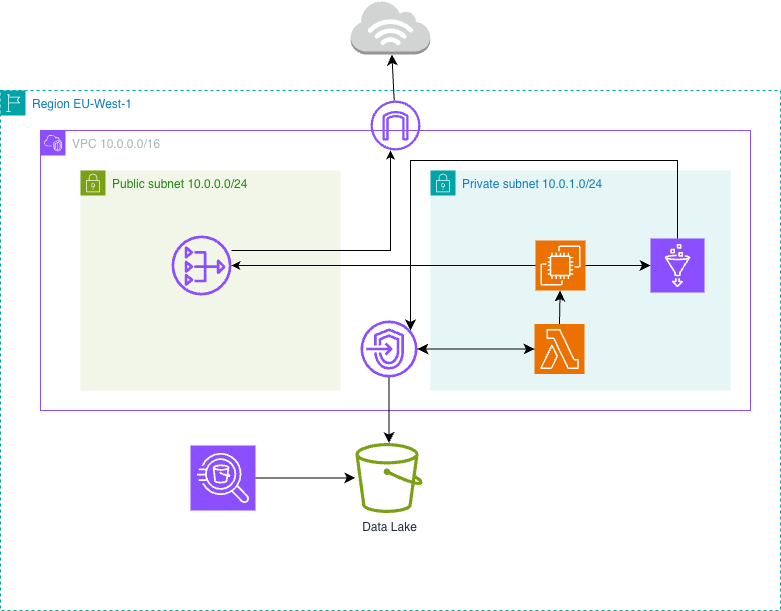

# Mobility Data Platform - AWS Ingestion Pipeline 🚗

This project simulates a real-time data ingestion platform for ride-sharing applications (e.g., Bolt, Uber). The entire infrastructure is hosted on AWS and managed as Infrastructure as Code (IaC) using Terraform.

## Architecture Diagram

## 🏗️ Infrastructure Architecture (Layers)

To ensure security, modularity, and to limit the blast radius in case of errors, the Terraform infrastructure is divided into independent layers. Each layer stores its state (`.tfstate`) remotely in a secure Amazon S3 bucket.

The layers are interdependent and must be deployed in a specific order. Higher layers (e.g., Kafka) read data from lower layers (e.g., Networking) using the `terraform_remote_state` data source.

### Directory Structure:
* **`0-bootstrap/`** - The base layer. Creates the S3 bucket with versioning and state locking (`use_lockfile` mechanism) enabled. This bucket stores the state files for all other layers.
* **`1-networking/`** - Network configuration (VPC, Subnets, Internet Gateway, Route Tables). Exposes its IDs to higher layers.
* **`2-storage/`** - S3 buckets acting as a Data Lake (for raw CSV files and processed Parquet data).
* **`3-kafka-broker/`** - EC2 server running Apache Kafka, located in the network created in layer 1.
* **`4-producer/`** - AWS Lambda function simulating the influx of real-time events.

